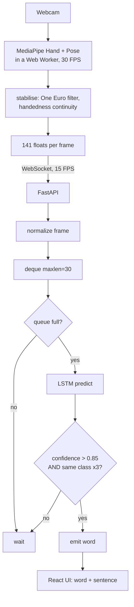
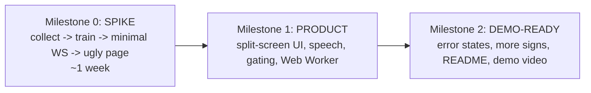

# Vox — Architecture

Real-time Indian Sign Language (ISL) interpreter. Recognizes signs from a webcam
and builds a two-person conversation.

> Drop this file at the repo root. If you're using Claude Code, you can rename it
> `CLAUDE.md` so it auto-loads as standing context for every session.

---

## Core principle

**Do the expensive computation as close to the user as possible.**

- The **browser** performs computer vision (MediaPipe hand tracking).
- The **backend** performs AI inference (LSTM sign recognition).
- The **UI** stays independent of ML computation.

This gives low latency, tiny network payloads, and a UI that never stutters
because a model is running.

---

## Scope — where the lines actually are

| Decision | Current choice | Why |
|---|---|---|
| Vocabulary (production) | **239 signs** from the ISLRTC dictionary | The avatar only needs one recording per word, so breadth is cheap here |
| Vocabulary (recognition) | The same 239, but only **37 verified at 80%+** | Recognition needs many recordings per word; the dictionary supplies one |
| Recognition mode | **Isolated words** (one sign at a time) | Continuous segmentation is a research problem, not a setting |
| Landmarks (recogniser) | **141 floats**: 2 hands × 21 × xyz, plus 5 pose points | The pose block is the body anchor; without it only finger shape survives |
| Landmarks (avatar) | **169 floats**: hand world landmarks plus **13** pose points with depth | A body has to be *drawn*, and wrists, hips and ears are not optional for that |
| Avatar geometry | MediaPipe **world landmarks** (metric, 3D) plus fixed anatomy | Image-space z is a weak guess; anatomy supplies what it cannot |
| Non-manual grammar | **Synthesised from the syntax** | Dictionary clips are citation forms with neutral faces — the marker is not in them |
| Sentence building | Confirmed words → ISL grammar → English | Word order carries meaning; a word list is not a sentence |

---

## Data flow



**Normalization is the one thing that must be identical** on the collection side
and the inference side. It lives in a single shared function (`ml/normalize.py`)
that `preprocess.py` and the backend both import. Anchoring is on the BODY —
origin at the shoulder midpoint, unit = shoulder width — not on the hand. An
earlier version pinned each wrist to (0,0), which erased both where a sign
happened and how it moved, leaving only finger shape; the model collapsed onto
one class. Missing hand → 63 zeros.

**Coordinates are defined at 16:9.** MediaPipe divides x by frame width and y by
frame height, so normalized coordinates are only comparable across axes at one
aspect ratio. Cameras of other shapes are rescaled onto 16:9 rather than being
handed to a model that has never seen those proportions
(`aspect_scale` in `ml/collect.py`, `aspectScale` in `frontend/src/tracking.ts`).

**Hand ordering must also be identical** everywhere: order the two hands
deterministically by MediaPipe handedness (e.g. Left block then Right block),
zero-padding whichever is absent. If collection and inference build the 126-vector
differently, predictions are garbage.

---

## Backend design

- FastAPI, async WebSocket endpoint.
- Per connection: `collections.deque(maxlen=30)` — constant memory, O(1),
  auto-drops old frames.
- Gating before a word is accepted: **confidence > 0.85** and **3 consecutive
  identical top predictions** (stability filter).
- Model and label map loaded once at startup.

## Frontend design

- **Conversation-first split screen.** Left: one lit stage carrying either the
  reference signing or your own. Right: the running conversation, the live
  recognition readout, and the composer.
- MediaPipe runs in a **Web Worker** so the React thread stays smooth.
- The worker emits **two views of the same frame**: the recogniser's 141-float
  vector, whose contract is frozen against `ml/collect.py`, and a separate
  13-point pose block for the avatar that is visibility-gated and in square
  units. Mixing them is how you get a model that silently stops working.

## The avatar

Two files, and the split is the point:

- `avatar/skeleton.ts` — where the body is. Recovers depth, enforces fixed bone
  lengths, solves an unseen elbow by IK, keeps limbs out of the chest, and
  relaxes to a rest pose when tracking stops.
- `avatar/rig.ts` — what the body is made of. Lofted torso, tapered limbs with
  deltoids, world-landmark hands, and a head with brows, lids and a mouth,
  because in ISL those carry grammar.

Both are exercised headlessly by `avatar/__checks__/skeleton.check.ts`, which
runs the solver over every frame of the library and asserts that bones never
change length, no joint ends up inside the torso, no arm goes missing, and
losing the input never moves a joint faster than the eye reads as a snap. See
`docs/3D-AVATAR.md`.

---

## Build strategy — spike first

The only genuinely uncertain part of this project is *whether the model can
recognize signs reliably*. So that gets built and validated first, before any UI
or plumbing is built around it.



- **Milestone 0 (spike):** prove 10–15 signs recognize live, end to end. Ugly is
  fine. If this works, everything after is engineering you already know how to do.
- **Milestone 1 (product):** the conversation-first UI, text-to-speech for
  sign→speech, stability polish, Web Worker. Speech→ISL-video is a *stretch*, not
  core.
- **Milestone 2 (demo-ready):** robustness, docs, recorded demo.

---

## Tech stack

- **Frontend:** React + Vite + TypeScript, `@mediapipe/tasks-vision`, three.js
- **Backend:** FastAPI + Uvicorn (async WebSockets)
- **ML:** Python, MediaPipe, TensorFlow / Keras (BiLSTM + attention pooling)

Custom Keras layers live in `ml/layers.py` because the backend has to be able to
reconstruct them when loading the saved model — defining them in `train.py` would
make the model unloadable by the process that serves it.

## Target folder structure

Build this out *gradually* — the spike only needs `ml/`, `backend/`, `frontend/`.

```
vox/
  ml/          # collect.py, preprocess.py, train.py, normalize.py, data/, models/
  backend/     # main.py (FastAPI + WebSocket), inference
  frontend/    # React + Vite app
  docs/        # this file + whatever follows working code
```

## Modularity

The model behind the backend is swappable (LSTM → GRU → Transformer → ST-GCN →
TFLite/ONNX) without touching the frontend, as long as the input contract
(30 × 126 normalized landmarks) holds.
