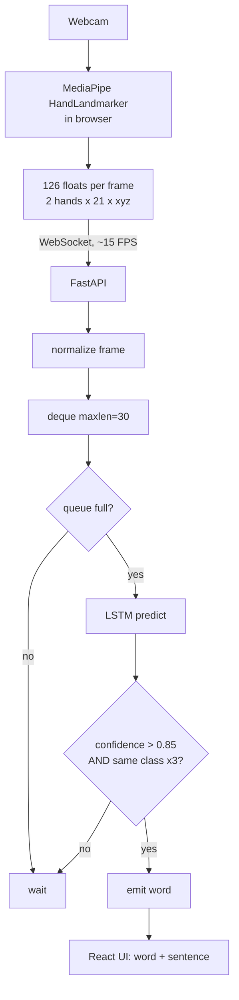
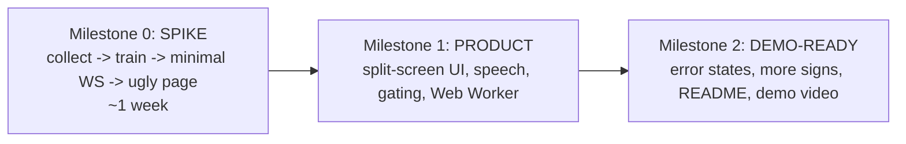

# Vox — Architecture

Real-time Indian Sign Language (ISL) interpreter. Recognizes signs from a webcam
and builds a two-person conversation.

> Drop this file at the repo root. If you're using Claude Code, you can rename it
> `CLAUDE.md` so it auto-loads as standing context for every session.

---

## Core principle

**Do the expensive computation as close to the user as possible.**

- The **browser** performs computer vision (MediaPipe hand tracking).
- The **backend** performs AI inference (LSTM sign recognition).
- The **UI** stays independent of ML computation.

This gives low latency, tiny network payloads, and a UI that never stutters
because a model is running.

---

## v1 scope — locked decisions

These are deliberately narrow. Breadth is added *after* the core works.

| Decision | v1 choice | Why |
|---|---|---|
| Vocabulary | **10–15 fixed signs**, visually distinct | A rock-solid 12-sign demo beats a shaky 50-sign one |
| Recognition mode | **Isolated words** (one held sign at a time) | Continuous sentence segmentation is a research problem; skip it |
| Landmarks | **Hands only** → 126 floats (2 hands × 21 pts × x,y,z) | Add face/pose only if accuracy demands it |
| Data | **30–50 samples/sign, 2–3 different people**, varied lighting | Data variety beats model cleverness; single-person data won't generalize to a judge |
| Sentence building | Assemble from confirmed words, gated by confidence + stability | Simple, robust, no segmentation needed |

---

## Data flow



**Normalization is the one thing that must be identical** on the collection side
and the inference side. Keep it in a single shared function
(`ml/normalize.py`) that both `train`/`preprocess` and the backend import. Per
hand: translate so the wrist (landmark 0) is the origin, then scale by a stable
reference distance (wrist → middle-finger MCP, landmark 9). Missing hand → 63
zeros.

**Hand ordering must also be identical** everywhere: order the two hands
deterministically by MediaPipe handedness (e.g. Left block then Right block),
zero-padding whichever is absent. If collection and inference build the 126-vector
differently, predictions are garbage.

---

## Backend design

- FastAPI, async WebSocket endpoint.
- Per connection: `collections.deque(maxlen=30)` — constant memory, O(1),
  auto-drops old frames.
- Gating before a word is accepted: **confidence > 0.85** and **3 consecutive
  identical top predictions** (stability filter).
- Model and label map loaded once at startup.

## Frontend design

- **Target UX (built later): conversation-first split screen.**
  - Left: large webcam + hand skeleton + confidence + detected word
  - Center: the running conversation (never scrolls away)
  - Right: ISL video playback (for speech → sign)
- MediaPipe runs in a **Web Worker** so the React thread stays smooth.
- **Spike UX (built first): one ugly page** — webcam + predicted word. Nothing else.

---

## Build strategy — spike first

The only genuinely uncertain part of this project is *whether the model can
recognize signs reliably*. So that gets built and validated first, before any UI
or plumbing is built around it.



- **Milestone 0 (spike):** prove 10–15 signs recognize live, end to end. Ugly is
  fine. If this works, everything after is engineering you already know how to do.
- **Milestone 1 (product):** the conversation-first UI, text-to-speech for
  sign→speech, stability polish, Web Worker. Speech→ISL-video is a *stretch*, not
  core.
- **Milestone 2 (demo-ready):** robustness, docs, recorded demo.

---

## Tech stack

- **Frontend:** React + Vite + TypeScript, `@mediapipe/tasks-vision`
- **Backend:** FastAPI + Uvicorn (async WebSockets)
- **ML:** Python, MediaPipe (data collection), TensorFlow / Keras (LSTM)

## Target folder structure

Build this out *gradually* — the spike only needs `ml/`, `backend/`, `frontend/`.

```
vox/
  ml/          # collect.py, preprocess.py, train.py, normalize.py, data/, models/
  backend/     # main.py (FastAPI + WebSocket), inference
  frontend/    # React + Vite app
  docs/        # this file + whatever follows working code
```

## Modularity

The model behind the backend is swappable (LSTM → GRU → Transformer → ST-GCN →
TFLite/ONNX) without touching the frontend, as long as the input contract
(30 × 126 normalized landmarks) holds.
