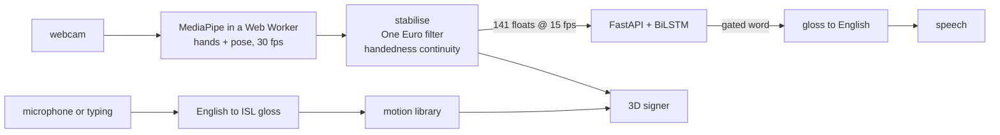

# Vox

A two-way Indian Sign Language interpreter that runs entirely on your machine.

- **Sign → speech.** Hands and upper body are tracked in the browser, an
  attention-pooled BiLSTM recognises isolated signs, the words are reassembled
  into an English sentence using ISL grammar, and it is read aloud.
- **Speech → sign.** What a hearing person says is glossed into ISL — reordered,
  not translated word-for-word — and performed by a 3D signing figure you can
  slow down, loop, and rotate.

No video ever leaves the machine. Only landmark numbers cross the local
WebSocket, and no footage is stored.

```bash
./start.sh        # macOS / Linux — creates venv + node_modules on first run
start.bat         # Windows
```

---

## What it knows

**239 signs**, drawn from the official Indian Sign Language dictionary published
by [ISLRTC](https://islrtc.nic.in/), an autonomous body under the Department of
Empowerment of Persons with Disabilities, Government of India.

The vocabulary is chosen for the conversations that actually matter without an
interpreter, not for a demo reel:

| | |
|---|---|
| **Grammar** | I, you, he, she, we, they, this, that, what, where, who, when, why, how, how many, how much |
| **Everyday verbs** | eat, drink, help, want, need, give, take, go, come, wait, stop, sleep, work, understand, know, pay, buy, meet, call |
| **Health & emergency** | pain, sick, doctor, nurse, hospital, medicine, tablet, injection, fever, blood, ambulance, police, fire, emergency, accident |
| **People & places** | mother, father, family, friend, home, school, market, bank, toilet, station |
| **Courtesy** | hello, please, sorry, thank you, yes, no, goodbye |

Adding more takes one command — see [Extending the vocabulary](#extending-the-vocabulary).

## Grammar, not word substitution

ISL is not English on the hands, and treating it as such produces output no
signer accepts. Vox implements the differences that decide whether a sentence is
understood at all:

| English | ISL gloss | why |
|---|---|---|
| What is your name? | `YOU NAME WHAT` | question words come last |
| I want water | `I WATER WANT` | subject–object–verb |
| Where is the hospital? | `HOSPITAL WHERE` | no copula, no article |
| I will go to the hospital tomorrow | `TOMORROW I HOSPITAL GO` | time comes first and carries the tense |
| I don't understand | `I UNDERSTAND NO` | negation follows the verb |
| She is a doctor | `SHE DOCTOR` | there is no sign for "is" |

The same rules run backwards. A signed `YOU NAME WHAT` is spoken as "What is
your name?", not read out as three words. Both the English sentence and the raw
gloss appear in the transcript, so it is always visible when the reconstruction
has guessed.

## The 3D signer

Every sign is landmark motion driving one rigged figure. The hands are built
from MediaPipe's metric `world_landmarks`, which carry real depth and real
finger proportions, and are placed in the signing space around the body using
their image-space wrist position.

This replaced a video player, for reasons that are not cosmetic:

- a clip can only be watched from the angle it was filmed at; the figure can be
  dragged and inspected from any side
- a clip cannot be slowed down without turning to mush
- every clip is a real person's likeness, which becomes a consent and licensing
  problem the moment the app leaves one laptop

The same rig also mirrors your own signing, so a learner comparing themselves
against the reference is looking at one object rather than two different
renderings of the same thing.

---

## Honest limits

Read this before showing Vox to anyone who might rely on it.

**No facial grammar.** ISL marks questions, negation and intensity on the face
and body — eyebrow raise, head shake, mouth morphemes. The avatar has none of it
and the recogniser is not trained on it. Output is grammatical but flat, and a
Deaf signer will notice immediately.

**One sign at a time.** Recognition reads a two-second window and names one
sign. Fluent signing runs signs together with no gaps, and separating them
(continuous sign language recognition) is an open research problem, not a
setting.

**Most words are unmeasured.** The dictionary provides one signer per word.
Accuracy can only be measured for words with a spare recording to hold back;
`ml/models/metrics.json` records exactly which words those are and what they
scored. Everything else is trained and served but unverified — treat those
predictions as suggestions.

**It is not an interpreter.** It is a tool for short, concrete exchanges. It
does not replace a qualified human interpreter for anything consequential.

---

## How it fits together



- **The browser** does the computer vision, which is why no video is transmitted.
- **The backend** does the ML: one 30-frame sliding window per connection, gated
  on confidence plus stability before a word is emitted.
- **Normalization is shared.** `ml/normalize.py` is imported by both training and
  the backend. Divergence there is the single most effective way to make the
  whole system silently output garbage.

Two frame rates, on purpose: detection runs at 30 fps because MediaPipe tracks
each hand from its previous position and shorter gaps mean fewer lost locks, but
frames reach the recogniser at 15 fps because that is the rate its training
sequences were sampled at.

See [ARCHITECTURE.md](ARCHITECTURE.md) for the design and
[docs/ROADMAP.md](docs/ROADMAP.md) for what is and is not done.

---

## Extending the vocabulary

The avatar can learn any word in the ISLRTC dictionary (about 6,600 indexed
entries) with one command:

```bash
python ml/add_words.py ambulance umbrella "railway station"
```

It resolves each word against the dictionary index, downloads the clip, extracts
the motion, and writes the sign. Reload the app and it is signable — no code
change, because the gloss engine treats any word the library has as a valid
gloss.

That extends what Vox can **say**. Teaching it to **understand** a word from you
is a different and more expensive problem: producing a sign needs one recording,
recognising one needs many. Record your own and retrain:

```bash
python ml/collect.py ambulance     # ~30 samples, vary distance and lighting
python ml/preprocess.py && python ml/train.py
```

Your own recordings are also the single most effective fix for "it doesn't
recognise *my* signing" — they teach the model your hands, your camera and your
room.

## Rebuilding everything

```bash
python ml/fetch_dictionary.py --plan       # resolve the vocabulary, review it
python ml/fetch_dictionary.py --download   # ~450 clips, roughly 25 minutes
python ml/build_motion.py                  # the avatar's motion library
python ml/extract.py --videos-dir ml/videos --rest-label rest
python ml/preprocess.py                    # train / val / test split, by video
python ml/train.py                         # writes the model and metrics.json
python ml/export_vocabulary.py             # regenerate the frontend word list
```

`--rest-label rest` matters. Without a rejection class the classifier must force
every gesture — including idle hands — into some real word, and confidently
emits nonsense whenever you are not signing.

The splits are made by *source video*, never by window. Windows from one
recording overlap heavily, so a random split puts near-duplicates on both sides
and reports memorisation as accuracy.

## Setup

Python **3.12** (`mediapipe` and `tensorflow` have no common wheels on 3.13+),
Node 20+.

```bash
python3.12 -m venv venv
source venv/bin/activate
pip install -r requirements.txt
cd frontend && npm install
```

## Credits and licensing

- Sign recordings: the [ISLRTC](https://islrtc.nic.in/) Indian Sign Language
  dictionary, Government of India. Used to derive landmark motion; **no video is
  redistributed** — this repository ships coordinates only.
- [INCLUDE](https://zenodo.org/records/4010759) (CC-BY-4.0), the multi-signer ISL
  dataset behind the greeting vocabulary and the only signer-independent
  accuracy figures here.
- MediaPipe Tasks (hand and pose landmarkers), TensorFlow/Keras, three.js,
  Lexend and Inter.
